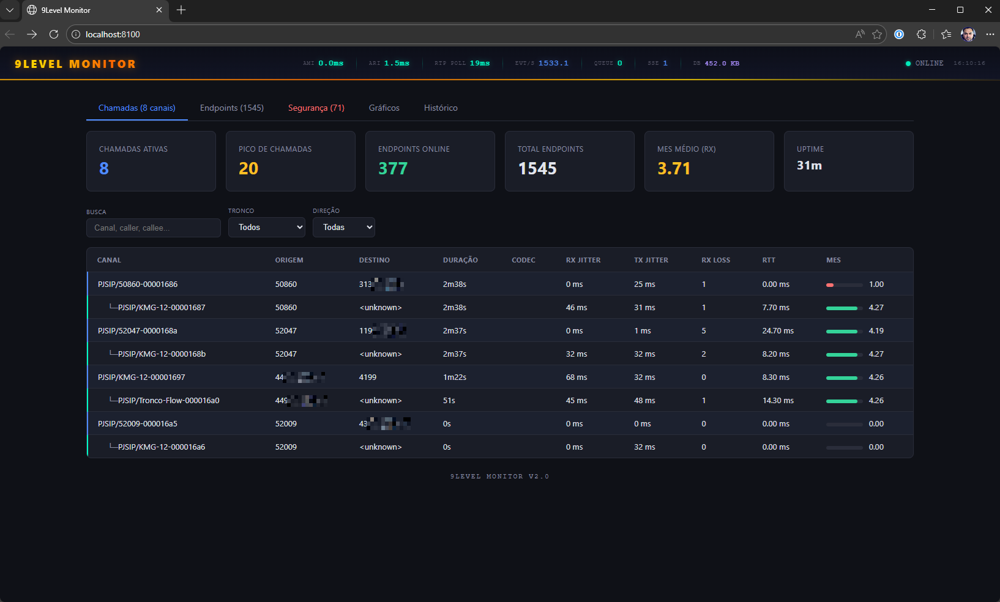
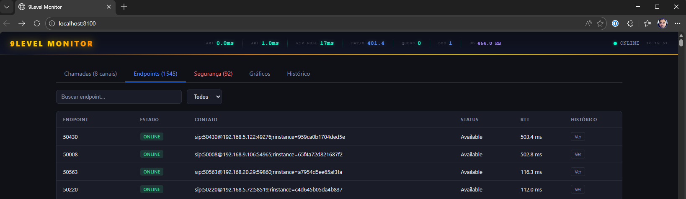
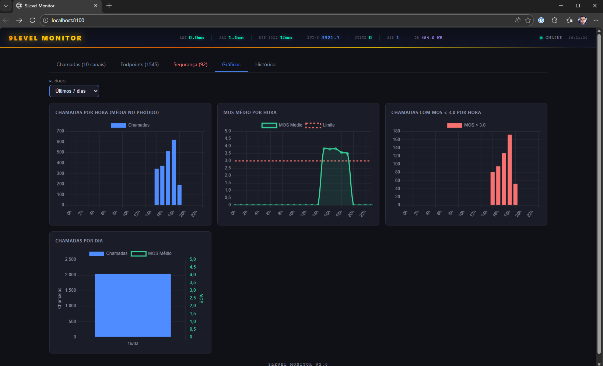
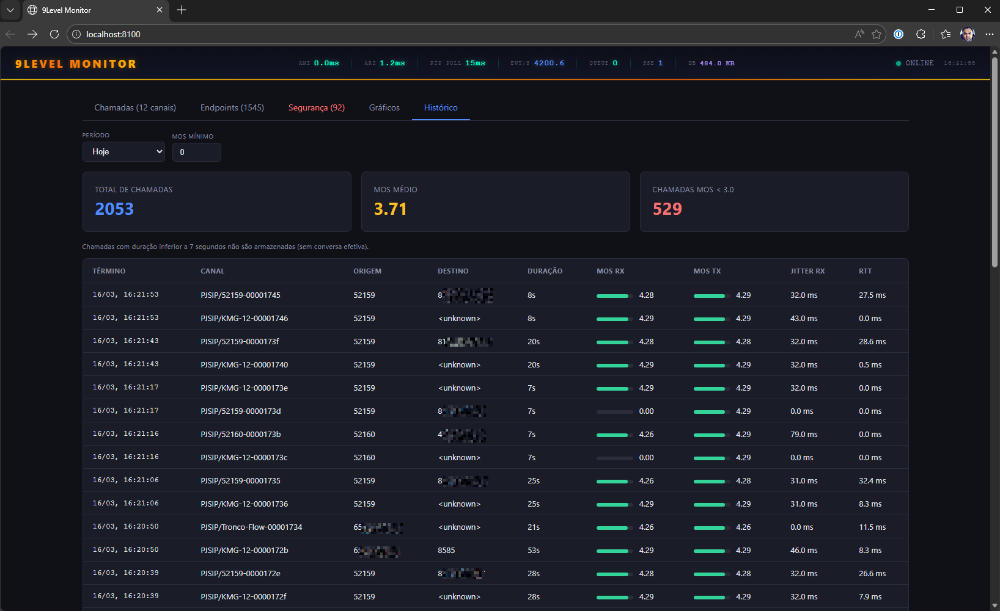
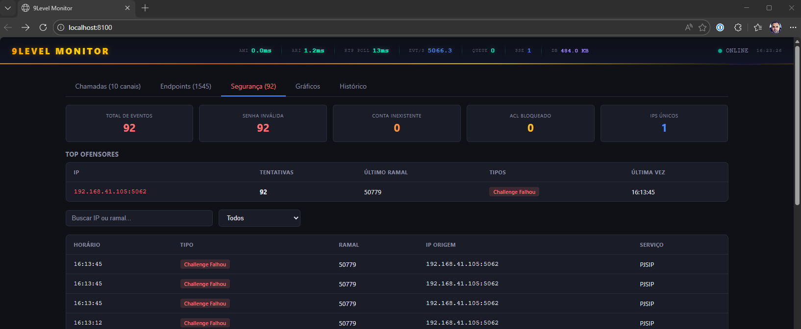
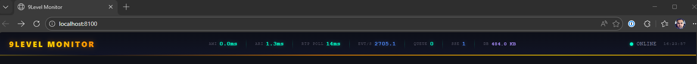

# 9Level Monitor

[](https://go.dev)
[](LICENSE)
[](Dockerfile)
[](https://www.asterisk.org)

Real-time Asterisk PBX monitoring via native **AMI** (TCP) and **ARI** (HTTP) interfaces. Track active calls with RTP quality metrics, monitor PJSIP endpoint status, detect security threats, and visualize historical trends — all from a single lightweight Go binary.

> **No custom Asterisk modules required.** Works with any standard Asterisk installation with AMI and ARI enabled.

## Screenshots

### Real-time Call Monitoring

*Active calls with real-time MOS, jitter, packet loss and RTT metrics. Grouped by call pair with codec and trunk detection.*

### PJSIP Endpoint Status

*All registered endpoints with online/offline state, contact URI, qualify RTT, and state change history.*

### Quality Charts

*Calls per hour, average MOS per hour, and problem calls (MOS < 3.0). Selectable time periods with daily comparison view.*

### Call History

*Searchable call history with quality metrics. Filter by date range and minimum MOS threshold.*

### Security Events

*Failed authentication attempts, ACL violations, and brute force detection. Top offenders ranking with IP tracking.*

### System Telemetry

*Real-time system health: AMI/ARI latency, events per second, queue depth, SSE clients, database size.*

## Features

- **Real-time call tracking** via AMI events (Newchannel, Hangup, DialBegin, BridgeEnter/Leave)
- **RTP quality metrics** — MOS (ITU-T G.107), jitter, packet loss, RTT per channel
- **PJSIP endpoint monitoring** — online/offline state, contact registration, qualify RTT
- **Security event detection** — failed auth attempts, ACL violations, unexpected addresses
- **SSE streaming** — push updates to frontend clients in real-time
- **Historical data** — SQLite persistence for call quality, endpoint changes, and security events
- **REST API** — full JSON API for integration with dashboards and alerting systems
- **Zero dependencies** — single Go binary + embedded web dashboard, no external database required
- **Docker ready** — multi-stage build, healthcheck, ~15MB image

## Quick Start

```bash
# Clone the repository
git clone https://github.com/9LEVEL/9level-monitor.git
cd 9level-monitor

# Configure
cp .env.example .env
# Edit .env with your Asterisk AMI/ARI credentials

# Option 1: Run with Docker (recommended)
docker compose up -d

# Option 2: Build from source
go build -o collector ./cmd/collector
./collector
```

The monitor listens on **port 3001** by default. Open `http://your-server:3001` in your browser.

### Asterisk Prerequisites

Enable AMI and ARI in your Asterisk configuration:

**`/etc/asterisk/manager.conf`**
```ini
[general]
enabled = yes
port = 5038
bindaddr = 0.0.0.0

[9level]
secret = your_secret
read = system,call,agent,security
write = system,command
```

**`/etc/asterisk/ari.conf`**
```ini
[general]
enabled = yes

[9level]
type = user
password = your_password
read_only = no
```

**`/etc/asterisk/http.conf`**
```ini
[general]
enabled = yes
bindaddr = 0.0.0.0
bindport = 8088
```

## Architecture

```
┌──────────────────────────────────────────────────────────────────┐
│                    9level-monitor (Go)                            │
│                        Port 3001                                 │
│                                                                  │
│  ┌────────────┐  ┌──────────┐  ┌───────┐  ┌──────────────────┐  │
│  │  Collector  │  │   API    │  │  SSE  │  │  Store           │  │
│  │ (event loop)│  │ Handlers │  │Broker │  │  (in-memory)     │  │
│  └─────┬──────┘  └──────────┘  └───────┘  │  - Channels      │  │
│        │                                   │  - Endpoints     │  │
│        │            ┌──────┐               │  - Bridges       │  │
│        │            │SQLite│               │  - Security      │  │
│        │            └──────┘               └──────────────────┘  │
└────────┼─────────────────────────────────────────────────────────┘
         │
         │  ┌──── AMI (TCP 5038) ──── Real-time events
         │  │     Newchannel, Hangup, DialBegin, BridgeEnter,
         │  │     BridgeLeave, RTCPSent, RTCPReceived,
         │  │     ContactStatus, PeerStatus, Security*
         ├──┤
         │  └──── ARI (HTTP 8088) ──── Periodic polling
         │        GET /channels (bootstrap + RTP stats)
         │        GET /asterisk/info (health check)
         ▼
┌──────────────────────────────────────────────────────────────────┐
│                       Asterisk PBX                               │
│                AMI port 5038  |  ARI port 8088                   │
└──────────────────────────────────────────────────────────────────┘
```

## Configuration

All settings via environment variables (or `.env` file). See [.env.example](.env.example) for a template.

| Variable | Default | Description |
|----------|---------|-------------|
| `AMI_HOST` | `127.0.0.1` | Asterisk AMI host |
| `AMI_PORT` | `5038` | AMI TCP port |
| `AMI_USER` | `9level` | AMI username |
| `AMI_SECRET` | *(required)* | AMI password |
| `ARI_BASE_URL` | `http://127.0.0.1:8088/ari` | ARI REST base URL |
| `ARI_USER` | `9level` | ARI username |
| `ARI_PASS` | *(required)* | ARI password |
| `PORT` | `3001` | HTTP server port |
| `DB_PATH` | `/data/9level.db` | SQLite database path |
| `RTP_POLL_INTERVAL` | `30s` | RTP stats polling interval via ARI |
| `ENDPOINT_REFRESH_INTERVAL` | `5m` | Endpoint re-sync interval via AMI |
| `SECURITY_WHITELIST_IPS` | *(empty)* | Comma-separated IPs to ignore in security events |

## REST API

Base URL: `http://localhost:3001`

### Real-time endpoints

| Endpoint | Description |
|----------|-------------|
| `GET /api/v1/monitor` | Full view: calls + endpoints + summary |
| `GET /api/v1/calls` | Active calls with RTP metrics |
| `GET /api/v1/calls/{id}` | Single call details |
| `GET /api/v1/endpoints` | All PJSIP endpoints with contacts |
| `GET /api/v1/summary` | Summary: active calls, online endpoints, avg MOS, peak, uptime |
| `GET /api/v1/health` | Health status: AMI/ARI connection, counts, SSE clients |
| `GET /api/v1/events` | SSE real-time event stream |
| `GET /api/v1/security` | Security events (paginated) |

### History endpoints (SQLite)

| Endpoint | Parameters | Description |
|----------|-----------|-------------|
| `GET /api/v1/history/calls` | `from`, `to`, `min_mos`, `page`, `per_page` | Paginated call quality history |
| `GET /api/v1/history/calls/stats` | `from`, `to` | Aggregated stats (total, avg MOS, bad calls) |
| `GET /api/v1/history/calls/hourly` | `from`, `to` or `date` | Per-hour breakdown |
| `GET /api/v1/history/calls/daily` | `from`, `to` | Per-day totals and avg MOS |
| `GET /api/v1/history/security` | `from`, `to`, `type`, `page`, `per_page` | Security event history |
| `GET /api/v1/history/endpoints` | `from`, `to`, `endpoint`, `page`, `per_page` | Endpoint state changes |

### SSE Events

Connect to `/api/v1/events` for real-time updates:

| Event | Description |
|-------|-------------|
| `call:new` | New channel created |
| `call:update` | RTP quality metrics updated |
| `call:end` | Call ended (includes duration) |
| `endpoint:update` | Endpoint state or contact changed |
| `endpoint:state_change` | Endpoint went online/offline |
| `summary:update` | Aggregated summary refresh |
| `health:update` | System health metrics |
| `security:event` | New security event detected |

## Project Structure

```
9level-monitor/
├── cmd/collector/main.go          # Entrypoint, wiring, HTTP server
├── internal/
│   ├── ami/                       # AMI TCP client with auto-reconnect
│   ├── ari/                       # ARI HTTP client (channels, RTP stats)
│   ├── api/                       # REST handlers + SSE broker
│   ├── collector/                 # Event loop, bootstrap, RTP polling
│   ├── config/                    # Environment-based configuration
│   ├── db/                        # SQLite persistence layer
│   └── store/                     # In-memory state (channels, endpoints)
├── frontend/index.html            # Embedded Vue 3 dashboard
├── Dockerfile                     # Multi-stage build (~15MB)
├── docker-compose.yml             # Production-ready deployment
└── .env.example                   # Configuration template
```

## Contributing

Contributions are welcome! Please open an issue or submit a pull request.

## License

[MIT](LICENSE)
